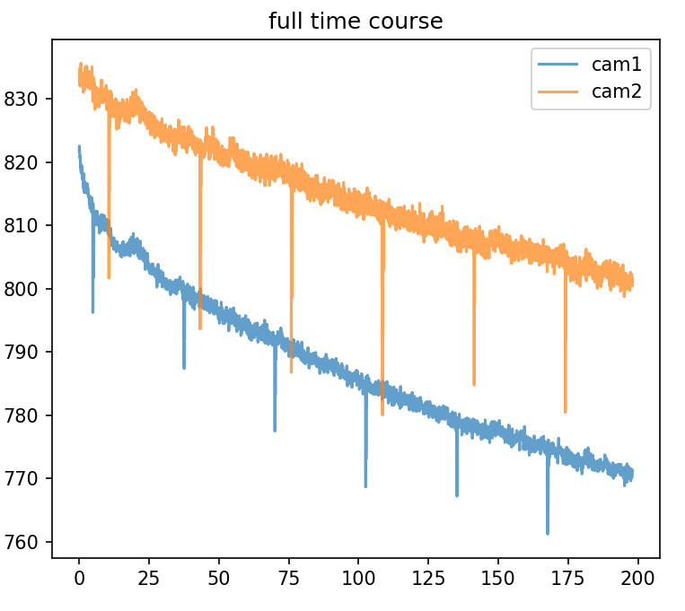
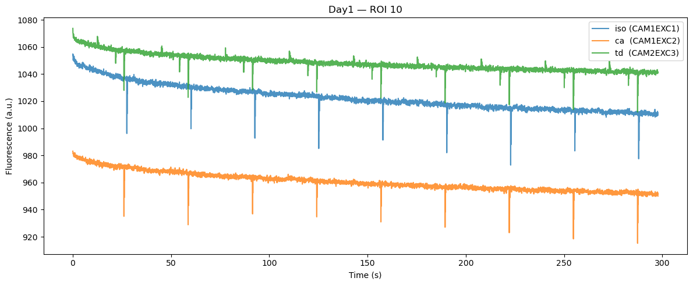

# Dopamine in odor‑tracking mice 

## Repo files

`preprocess_photometry.py`: run the script to process the fiberphotometry data

`analysis_notebook.ipynb`: pipeline for visual inspection of processed photometry data and behavior data, computing behavior metrics (odor trail following features) and basic analysis/alignment between bahvior and neural data

## Large artefacts in photometry - Summary
- The large **downward dips** seen in **isosbestic (CAM1EXC1)** and **GCaMP (CAM1EXC2)** are liekly not due to timestamp misalignment or dropped frames
- Hardware timing is **tight**: camera frame times align to Digital I/O (TTL) edges
- Dips are **periodic**, **global across ROIs** within an animal, and visible on **multiple channels** -> most consistent with **pulse/LED bleed‑through**
- **Workaround solution**: **detect** sharp downward spikes, and **patch only those points** before any processing

---

## Data Streams (Doric)
- **CAM1EXC1** - isosbestic control: calcium‑independent GCaMP fluorescence to correct motion/bleaching
- **CAM1EXC2** - GCaMP signal: calcium‑dependent fluorescence
- **CAM2EXC3** - tdTomato

**Paths**
```text
DataAcquisition/BBC300/ROISignals/Series0001/CAM1EXC1
DataAcquisition/BBC300/ROISignals/Series0001/CAM1EXC2
DataAcquisition/BBC300/ROISignals/Series0001/CAM2EXC3

DataAcquisition/BBC300/Signals/Series0001/DigitalIO/(Camera1, Camera2, Time)
DataAcquisition/BBC300/Signals/Series0001/AnalogOut/(AnalogCh1..3, Time)
```

---

## Observation: 
Offset between CAM1EXC1 and CAM1EXC2 and some large drops



**What timestamps show**
- Channels are **interleaved** (LED multiplexing). First samples typically look like:
  - CAM1EXC1: `0.001, 0.051, 0.101, …` s  
  - CAM1EXC2: `0.026, 0.076, 0.126, …` s
- At **20 Hz**, this is ~**25 ms** offset: **far too small** to explain multi‑second discrepancies.

---

## What the Dips Look Like
- **Periodic** within a session (period varies **between animals**)
- **Global across ROIs** within the same animal
- Similar shape on **isosbestic** and **GCaMP**; **tdTomato** often follows the calcium channel timing; isosbestic can look slightly shifted.



**Interpretation:** these features match **pulse/LED bleed‑through** (residual light or electrical drive leaking into measurement frames)

---

## Timing control: Alignment to camera TTL
Match each ROI frame time to the nearest **camera TTL edge** and summarize residuals, parity, and gaps.

**Example results**
```text
[CAM1EXC1 vs DIO/Camera1] frames: 3962, ttl edges: 7924
  residuals (ms): median = -1.00, IQR ≈ [-1.00, -1.00]
  within 10 ms: 100.0%  (even edges: 100.0%, odd edges: 0.0%)
  TTL big gaps: 0

[CAM1EXC2 vs DIO/Camera1] frames: 3961, ttl edges: 7924
  residuals (ms): median = -1.00, IQR ≈ [-1.00, -1.00]
  within 10 ms: 100.0%  (even edges: 0.0%, odd edges: 100.0%)
  TTL big gaps: 0

[CAM2EXC3 vs DIO/Camera2] frames: 3961, ttl edges: 3962
  residuals (ms): median = -1.00, IQR ≈ [-1.00, -1.00]
  within 10 ms: 100.0%  (even: 50.0%, odd: 50.0%)
  TTL big gaps: 0
```

- Frames are **hardware‑locked** (tight ~–1 ms fixed lag).
- **No dropped frames** (no abnormal gaps).

> The dips themselves are **not time‑locked** to camera TTL edges, consistent with a **driver/LED artifact** rather than frame timing faults.

---

## Preprocessing Decisions (on raw data)

In file `preprocess_photometry.py`:

### 1) Patch “isolated dips” (point‑wise)
`fix_isolated_points`: if a sample is **> X units** below its neighbors, replace it with the closest neighbor or a short linear interpolation.  
- Operates **only** at detected outliers.  

### 2) Mask & patch sharp downward spikes
`mask_artifacts`: detect indices with
- a **sudden drop** above a threshold, and/or  
- a **large negative derivative** (optionally after light smoothing),  
then **mask** and **interpolate** those points only.  
